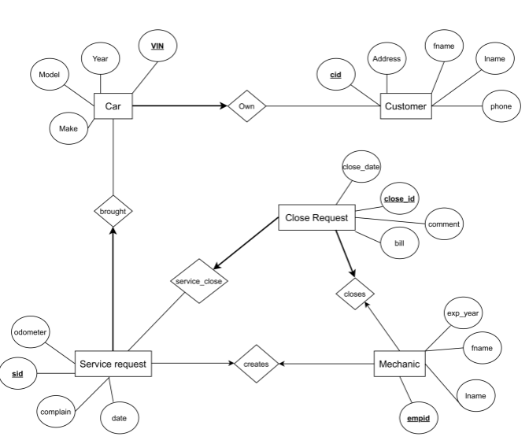

# cs166-project
## ER DIAGRAM

## RELATIIONS
```
------------
---TABLES---
------------
CREATE TABLE Customer
(
	id INTEGER NOT NULL,
	fname CHAR(32) NOT NULL,
	lname CHAR(32) NOT NULL,
	phone CHAR(13) NOT NULL,
	address CHAR(256) NOT NULL,
	PRIMARY KEY (id)
);

CREATE TABLE Mechanic
(
	id INTEGER NOT NULL,
	fname CHAR(32) NOT NULL,
	lname CHAR(32) NOT NULL,
	experience _YEARS NOT NULL,
	PRIMARY KEY (id) 
);

CREATE TABLE Car
(
	vin VARCHAR(16) NOT NULL,
	make VARCHAR(32) NOT NULL,
	model VARCHAR(32) NOT NULL,
	year _YEAR NOT NULL,
	PRIMARY KEY (vin)
);
---------------
---RELATIONS---
---------------
CREATE TABLE Owns
(
	ownership_id INTEGER NOT NULL,
	customer_id INTEGER NOT NULL,
	car_vin VARCHAR(16) NOT NULL,
	PRIMARY KEY (ownership_id),
	FOREIGN KEY (customer_id) REFERENCES Customer(id),
	FOREIGN KEY (car_vin) REFERENCES Car(vin)
);

CREATE TABLE Service_Request
(
	rid INTEGER NOT NULL,
	customer_id INTEGER NOT NULL,
	car_vin VARCHAR(16) NOT NULL,
	date DATE NOT NULL,
	odometer _PINTEGER NOT NULL,
	complain TEXT,
	PRIMARY KEY (rid),
	FOREIGN KEY (customer_id) REFERENCES Customer(id),
	FOREIGN KEY (car_vin) REFERENCES Car(vin)
);

CREATE TABLE Closed_Request
(
	wid INTEGER NOT NULL,
	rid INTEGER NOT NULL,
	mid INTEGER NOT NULL,
	date DATE NOT NULL,
	comment TEXT,
	bill _PINTEGER NOT NULL,
	PRIMARY KEY (wid),
	FOREIGN KEY (rid) REFERENCES Service_Request(rid),
	FOREIGN KEY (mid) REFERENCES Mechanic(id)
);
```
